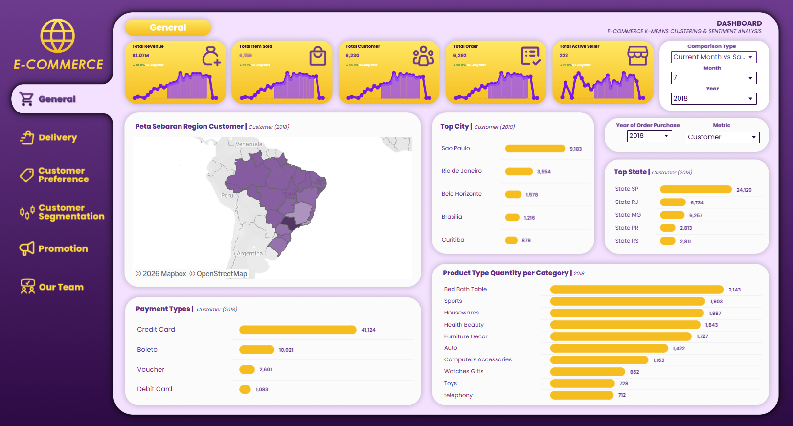
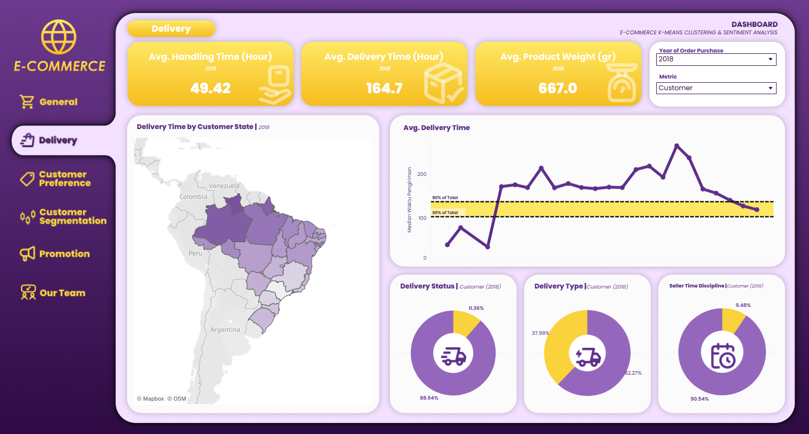
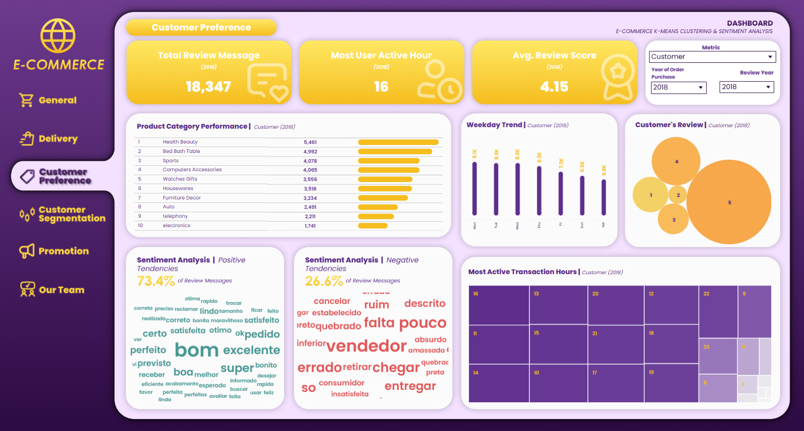
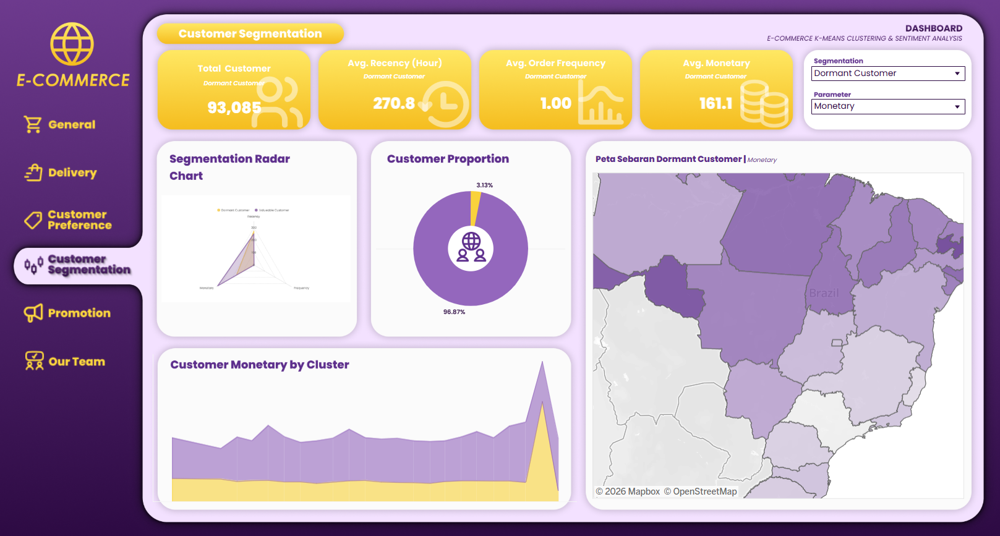
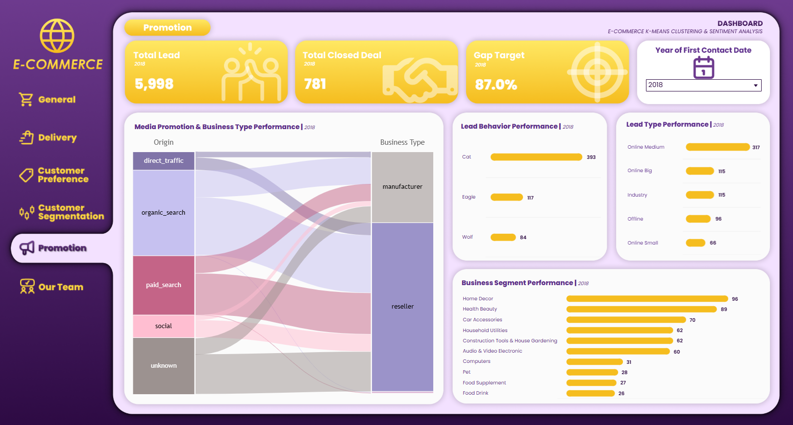

## 📊 Tableau Interactive Dashboard
• Processed over 99k Brazilian e-commerce transaction records using R and Python, applying K-Means clustering for customer segmentation and a lexicon-based model (OpLexicon) to categorize reviews into positive, negative, and neutral sentiments. 
• Translated raw multi-table relational data into actionable recommendations to evaluate delivery performance, assess product quality based on feedback, and identify buyer preferences for strategic decision-making. 
• Developed dynamic filters, KPI summaries, and data storytelling components to communicate insights effectively to non-techincal audiences.

🔗 **[Click here]([https://public.tableau.com/your-dashboard-link](https://public.tableau.com/app/profile/joshua.bryan5619/viz/SSDC2025003_DUAKATA/Tab1General))**

---

### 📷 Dashboard Previews

)

)

)

)

)
